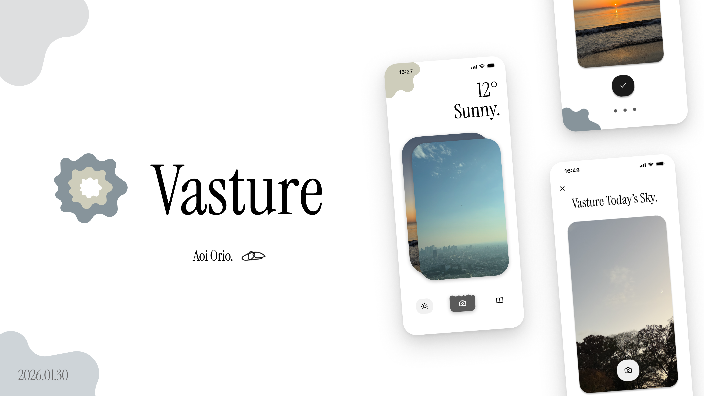

<div style="text-align: center;">
    
</div>

<br>

### 📚 Folder Structure
コードがスパゲッティになってしまいがちなので、オニオンアーキテクチャで構成しました。UIとロジックを分離しています。

```python
└── 📁lib
    └── 📁core
        └── 📁config # アプリ内全体で使うクライアントやapi url
        └── 📁constants # 定数定義
        └── 📁error # エラーレスポンス定義
        └── 📁utils # 色クラスや共通関数定義
    └── 📁data
        └── 📁datasources # クライアントの実装関数 (repositoriesから呼び出される)
            └── 📁local
            └── 📁remote
        └── 📁models # freezedでDBモデル定義
        └── 📁repositories # domain層で定義した関数の実装
    └── 📁domain
        └── 📁entities # クライアントのレスポンス定義
        └── 📁repositories # 骨組みとなる関数
        └── 📁usecases # UI側で呼び出す関数
    └── 📁presentation # プレゼン層
        └── 📁providers # 状態管理
        └── 📁screens # 画面UI
        └── 📁theme # テーマ定義
        └── 📁widgets # 共通のwidgetsやコンポーネント
            └── 📁common
    └── 📁routes # ナビゲーション関連
    └── main.dart
```