<div align="center">
    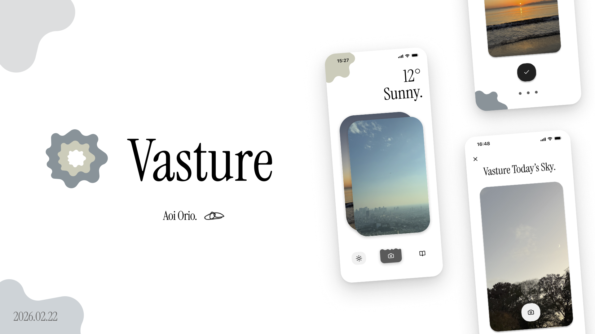
</div>

<br>

<div align="center">


[](https://wxtech.weathernews.com/products/data/api/operations/get1kmMeshPinpointWeatherForecast/)
[](https://github.com/Vasture-Us/vasture-back)
[](https://github.dev/Vasture-Us/vasture-front/)

</div>

<br>

## 🍹 Contents
<!-- START doctoc generated TOC please keep comment here to allow auto update -->
<!-- DON'T EDIT THIS SECTION, INSTEAD RE-RUN doctoc TO UPDATE -->

- [😎 About Vasture](#-about-vasture)
  - [Features](#-features)
  - [UI Screens](#-ui-screens)
  - [Reason](#-reason)
  - [Persona](#-persona)
  - [Next Features](#-next-features)
  - [Next Steps](#-next-steps)
- [📺 Technologies](#-technologies)
  - [How to run?](#-how-to-run)
  - [Folder Structure](#-folder-structure)
  - [ER Graph](#-er-graph)

<!-- END doctoc generated TOC please keep comment here to allow auto update -->

<br>

## 😎 About Vasture
Vastureは「あなたの空と世界の空をつなげるSNSアプリ」です。

空の写真を撮ると、その日世界の誰かが撮ったもう一枚の「空」を見ることができ、**広大な空**を通じて**ちょっとしたつながり**を感じることができます。


<div style="text-align:center;">
    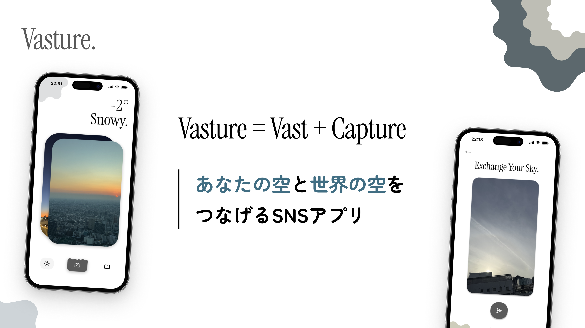
</div>

<br>

### 🐊 Features
- **空を撮ると、その日世界で撮られた「違う空」を見つける機能**
    - ユーザーの撮った写真が即座に空かどうかを[自作AIモデル](https://github.com/Vasture-Us/vasture-back)で判別し、空以外であれば受け付けません
- **空の写真を天気と共に集め、保存する機能**
    - 何気なく撮ったあの空の情景を残すことで、その日の思い出や感情が雲のように湧き出てきます
- **ウェザーニューズ様のAPIを使用し、天気予報を表示する機能**
    - 天気によって画面の上部にあるシェイプの色が変わる仕様です

<br>

### 🎬 UI Screens
- 主要画面一覧

|WeatherScreen|CameraScreen|WeatherBookScreen|
|----|----|----|
|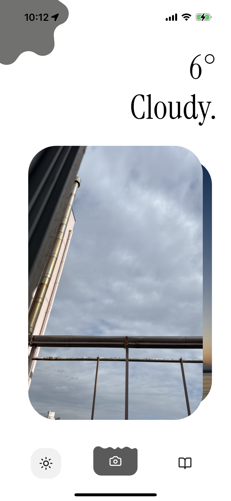|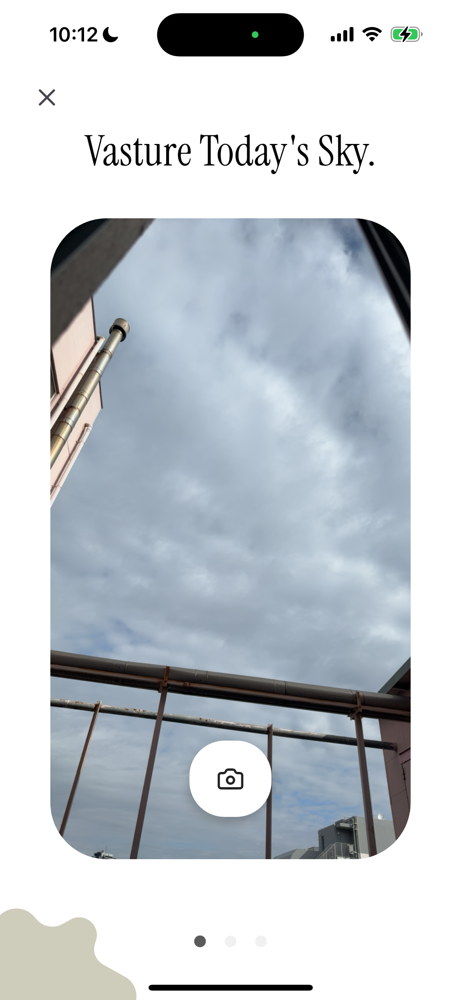|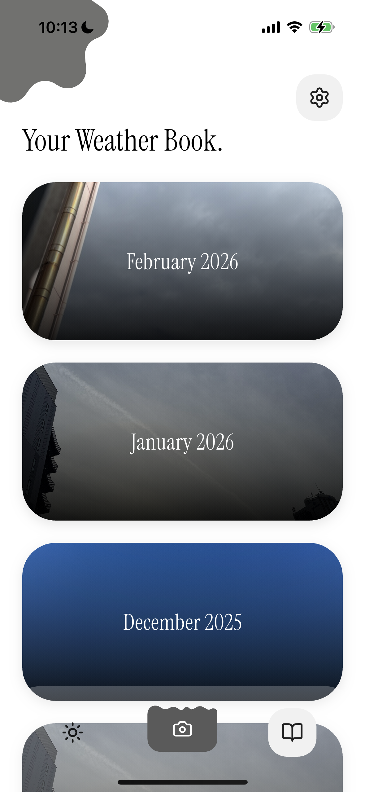|

- その他の厳選した画面

|ConfirmationScreen|FoundSkyScreen|WeatherScreen (今日の写真なし)|
|----|----|----|
|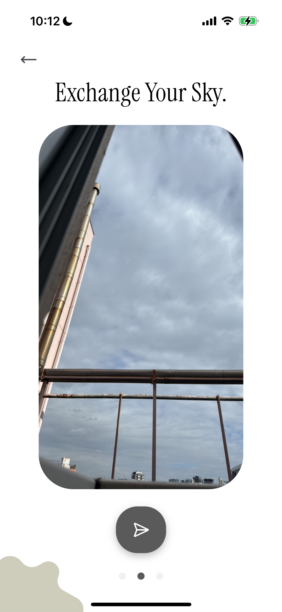|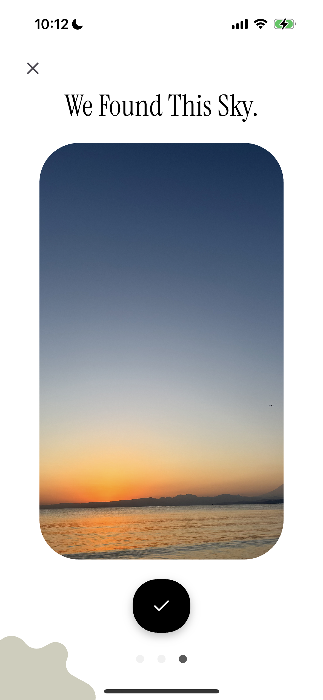|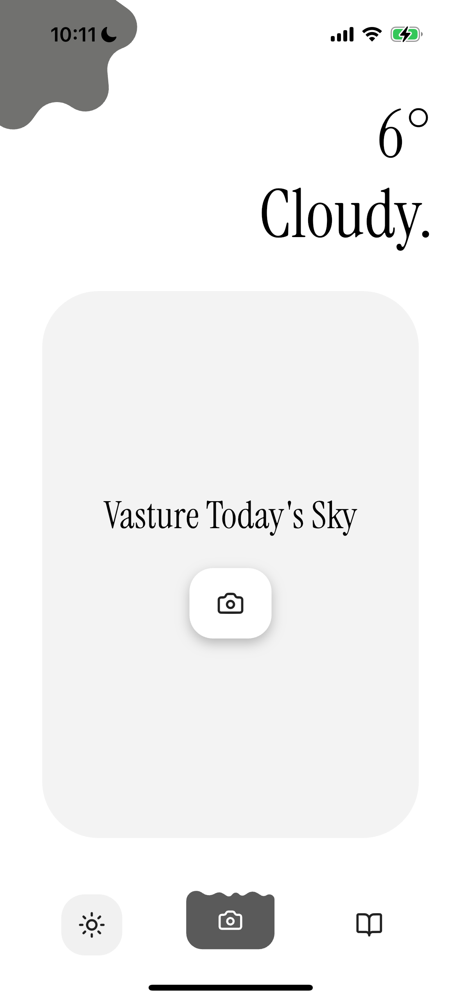|

<br>

### 🍕 Reason
現在、私は15年間住んでいた、地元沖縄を離れ東京で1人で暮らしています。
ふと道端を歩いていて、空を見上げると孤独だったり寂しさが消え、**世界の広さやつながる感覚**をより多くの女性に届けたいと思い、開発しました。

空はこんなにも広いのだから、上を見てほしい。そして、最終的に空や天気へ自然と興味を持ってもらいたい。そんな思いもVastureには詰まっています。

<br>

### 🙆‍♂️ Persona
- ターゲット: 孤独や寂しさを感じている10代から20代の女性

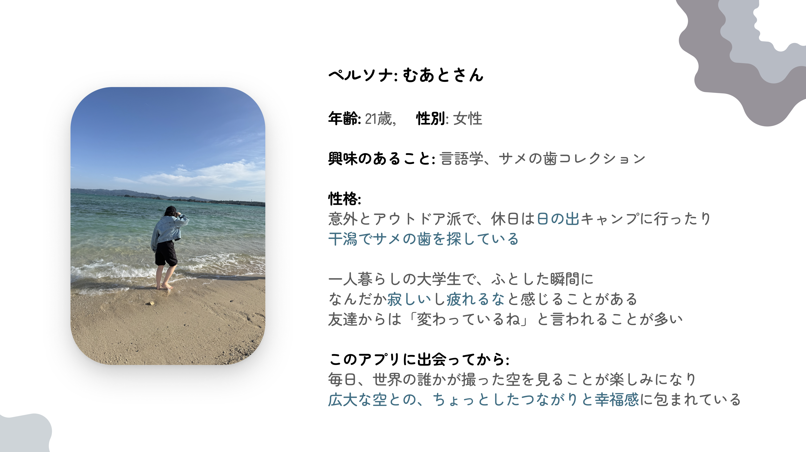

<br>

### ☕️ Next Features
実装予定の機能たち
- シェア機能
    - 空の写真を外部アプリでシェアできます
- プライベートVasture機能
    - ワンタイムパスワードを入力し、特定のユーザーのみと空の写真を交換できます
- Widget機能
    - ホーム画面にWidgetを配置し、その日の空の写真を一目で見ることができます
- 位置表示機能
    - 空の写真が撮られた場所を保存し、マッチしたユーザーに表示します
    - WeatherBookの画面に場所の名前を表示します

<br>

### 🧠 Next Steps
1. App Storeにリリース
    - CI/CDを構築し自動化を図ります
2. グローバル化
- 私はアメリカの大学に進学するので、教授やクラスメートにVastureを広め、フィードバックをいただきたいと考えました。また、アメリカの空を撮りアプリ内の日本のユーザーに「私はアメリカにいる」と空で伝えたいです。
3. MAU1万人突破
- メンテナンスを続け、Monthly Active Usersの1万人突破を目指しています
- 有償のデータライセンスでウェザーニューズ様、企業様にユーザーの天気と空の画像データを提供します
- 以前企業のCTOの方とお話した際に、開発したアプリ内で広告や有料化を実施する場合、ユーザーがある程度増えてからがいいとアドバイスをいただいたので、現在は企業様向けの収益化を考えています

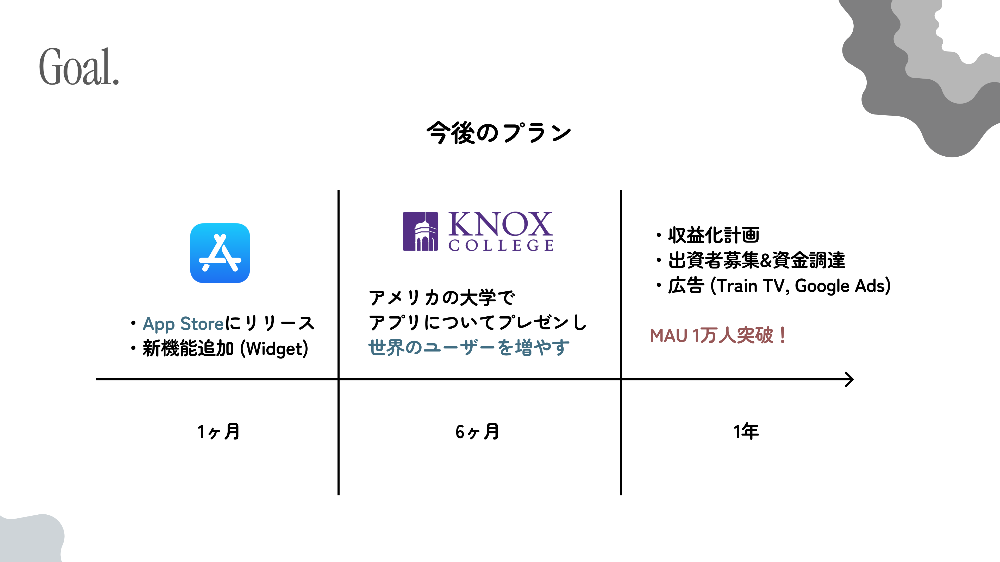

<br>

## 📺 Technologies
Vastureのビルド方法、構成をご紹介します。

<br>

### ⌛️ How to run?

> For Setting
- まず、SupabaseにてER図を参考にDBを作成してください。
- 以下のコマンドで.envファイルを作成
    ```bash
    cp .env.example .env
    ```
- .envファイルにそれぞれの定数を格納してください。

> For Flutter

1. fvmを[こちらの記事](https://zenn.dev/altiveinc/articles/flutter-version-management)を参考にインストールする
2. バージョンを合わせる
```bash
fvm use 3.35.7
```
3. アプリのビルド、インストール
```bash
flutter run ios
```
4. 🍀 Completed!

<br>

### 📚 Folder Structure
コードがスパゲッティになってしまいがちなので、クリーンアーキテクチャで構成しました。UIとロジックを分離しています。

```bash
└── 📁lib
    └── 📁core # アプリ内全体で使う定数やエラーの定義
        └── 📁config
        └── 📁constants
        └── 📁error
    └── 📁data
        └── 📁datasources # クライアントの実装関数 (repositoriesから呼び出される)
            └── 📁local
            └── 📁remote
        └── 📁models
        └── 📁repositories # domain層で定義したrepositoryの実装
    └── 📁domain
        └── 📁entities
        └── 📁repositories # 骨組みとなるrepository
        └── 📁usecases
    └── 📁presentation # UI周りを実装するプレゼン層
        └── 📁components
        └── 📁providers
        └── 📁screens
        └── 📁services
        └── 📁utils
            └── 📁helpers
            └── 📁routes
            └── 📁state
            └── 📁theme
    └── main.dart
```

<br>

### 💬 ER Graph
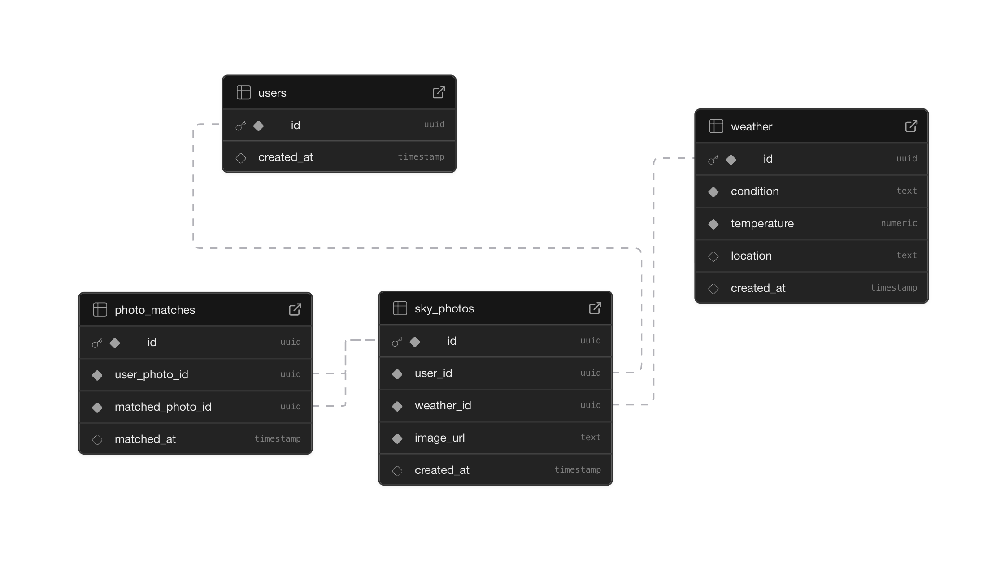

<br>

## ☁️
「空」は無数にある。
人それぞれの空がある。

そして、それらは一つにつながっている。

一つの大きな世界と一緒に
あなただけの空がここにはある。

<br>

### 😉 Written by [@aoiorio](https://github.com/aoiorio)
### 🥞 Thank you so much for reading!

<a href="https://buymeacoffee.com/aoiorio" target="_blank">
    
</a>